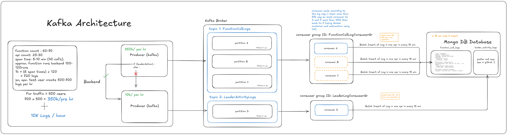

# Kafka Architecture Documentation

## Overview
This document describes the Kafka-based logging architecture for backend function calls and leader activities. It explains how logs are generated, processed, and stored efficiently in a MongoDB database.



## Table of Contents
- [Logging Flow](#logging-flow)
- [Backend Log Generation](#backend-log-generation)
- [Kafka Broker & Topics](#kafka-broker--topics)
- [Consumers & Processing](#consumers--processing)
- [MongoDB Storage](#mongodb-storage)
- [Scalability Considerations](#scalability-considerations)

---

## Logging Flow
1. **Log Generation**: Backend generates logs from function calls and leader activities.
2. **Kafka Producers**: Send logs to Kafka topics.
3. **Kafka Broker**: Distributes logs into partitions.
4. **Kafka Consumers**: Batch process logs and insert them into MongoDB.

---

## Backend Log Generation
- **Function count**: 60-70
- **API count**: 25-30
- **Span time per function**: 5-10 min (~40 calls per span)
- **Backend function runs**: 100-120 runs per hour
- **Logs per hour per user**: ~500-700
- **Traffic estimation for 500 users**:
  - 350K logs per hour from function calls
  - 10K logs per hour from leader activities

---

## Kafka Broker & Topics
### **Topics & Partitions**
1. **Topic: FunctionCallLogs**
   - Partition A: 100K logs per hr
   - Partition B: 100K logs per hr
   - Partition C: 100K logs per hr
2. **Topic: LeaderActivityLogs**
   - Partition D: 10K logs per hr

### **Producers**
- **FunctionCallLogs**: 350K logs/hr
- **LeaderActivityLogs**: 10K logs/hr
- Condition: If `leaderAction`, logs go to `LeaderActivityLogs`, otherwise `FunctionCallLogs`.

---

## Consumers & Processing
### **Consumer Groups**
1. **FunctionCallLogConsumerGr**
   - Consumer A: Batch insert every 15 min
   - Consumer B: Batch insert every 15 min
   - Consumer C: Batch insert every 15 min
   - Log Size: ~27K-35K logs per operation
2. **LeaderLogConsumerGr**
   - Consumer D: Batch insert every 15 min
   - Log Size: ~3K-5K logs per operation

---

## MongoDB Storage
- **Collections**:
  - `function_call_logs`
  - `leader_activity_logs`
- **Insert Optimization**:
  - Each batch operation occurs every 15 minutes.
  - Only **4 bulk inserts per hour**.
  - GitHub repository contains implementation details.

---

## Scalability Considerations
- **Auto-scaling Consumers**:
  - If log messages exceed **50K per topic**, scale consumer count to **2**.
  - If logs exceed **100K per topic**, scale to **3**.
  - Scaling is managed via **Docker containers & YAML automation**.


## How use in backend for loging

```javascript
const sendFunctionCallLog = require("./producers/functionCallProducer");
const sendLeaderActivityLog = require("./producers/leaderActivityProducer");

// Example Function Call Log
const functionLog = {
    LogID: "LOG0001001",
    endpoint: "/api/v1/users",
    timestamp: new Date().toISOString(),
    parameters: { attribute1: "value1", attribute2: "value2" },
    function_name: "getUserProfile",
    http_method_type: "GET",
    header: { Authorization: "Bearer abc123", "Content-Type": "application/json" },
    log_message: "Operation Successful",
    log_type: "info",
};

sendFunctionCallLog(functionLog);
```

```javascript
// Example Leader Activity Log
const leaderLog = {
    leader_activity: "member_status_updated",
    default_data: { type: Object },
    before_update_data: { type: Object },
    after_change_data: { type: Object },
    log_timestamp: new Date().toISOString(),
};

sendLeaderActivityLog(leaderLog);
```