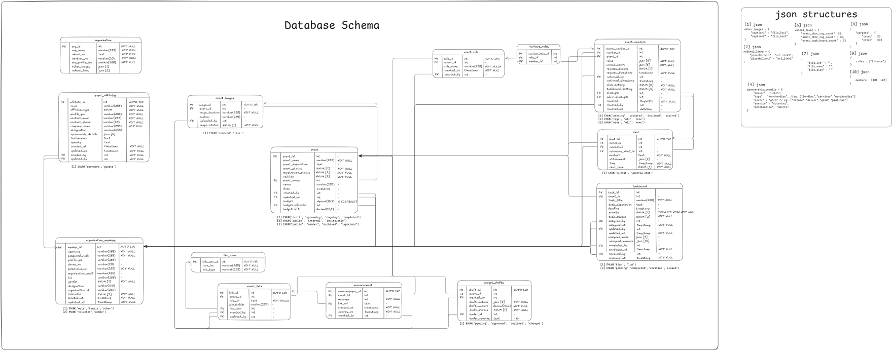

# Database Schema Documentation  

## Overview  
This document provides a detailed description of the database schema used for managing organizations, events, tasks, budgets, and users. It includes table structures, relationships, and JSON structures for specific fields.  

